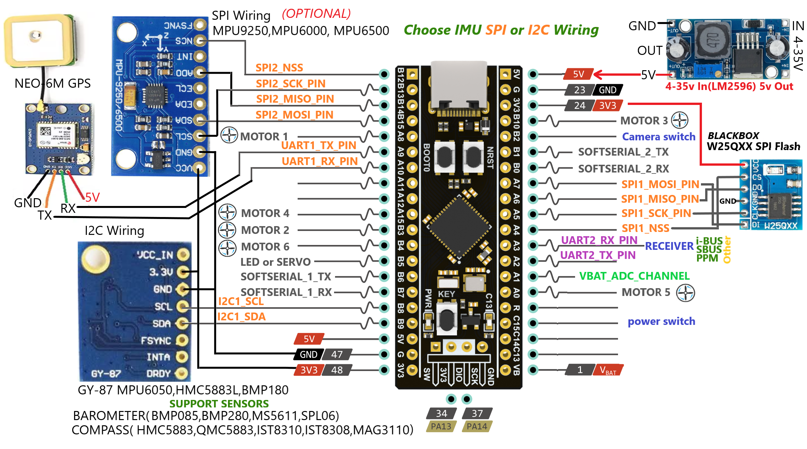

# Attention please
An Acceleration and Gyroscope module must be connected to the board. It will not connect to the Bare Board Configurator. Please do not ask questions about this.

### NOTE
For each INAV version, you must download the configuration for that version. In short, for the INAV 6.1.1 version, you need to download and use the INAV 6.1.1 configuration.
For INAV 7.1 version, you need to download and use INAV 7.1 configuration.

## Portable Configurator on Phone and Tablet

We would like to thank esteemed https://github.com/suchigno Suchigno for preparing this support. 

If you want to use the configurator on your phone or tablet you can do it using an app: SpeedyBee. (https://www.speedybee.com/speedy-bee-app/)

Available for Android and iOS, I think it is the best, complete and free to have an INAV compatible drone configurator.
There are 2 ways to connect the F411:

- using a USB OTG cable connected to your phone or tablet.
 Not very convenient because if you have to calibrate for example it has a cable that hinders your movements. If you connect it to the board you must remove the 5v power coming from the ESCs.

- using a BLE 4.0 module
I tested two different modules: HM-11 and HC-05.

NOTE: if you use the HM-11 module without adapter, small and light, you have to use a 5v to 3.3v converter, I used this one

In both cases you have to use AT commands to change the name of the module (optional), change the baurate to 57600.
Also in the configurator you must set the baud rate of the chosen port to 57600.
You can use one of the board's serial ports, if you don't use GPS you can use the uart, or the software serial ports.
[Here](https://github.com/rizacelik/STM32F411CEU6_INAV_Firmware/issues/57) you can find the updated PCB where I added a connector for software serial 2.
The BLE modules consume little power, you can always leave it connected and use the app to, for example, check before the flight that the GPS has correctly configured the home point, way point, etc. without using the OSD.

## PCB project
All the details are here https://github.com/rizacelik/STM32F411CEU6_INAV_Firmware/issues/57

# Responsibility and resource
This is the unofficial target for INAV( Original source: https://github.com/iNavFlight/inav). Provides support for flight control boards that do not have official INAV support for the STM32F411CEU6 board. 
Whether or not to use this firmware is the user's responsibility and is free to do so. INAV developer link : https://github.com/iNavFlight/inav/tree/master/docs/development You can find all the details for firmware development here.

# STM32F411CEU6 INAV Firmware AND Betaflight Firmware
STM32F411CEU6 Board Firmware
First, let's connect the board and the computer.

# Download INAV Configurator
https://github.com/iNavFlight/inav-configurator/releases

# Windows
Download Configurator for Windows platform (win32 or win64 is present)
Extract ZIP archive
Run INAV Configurator app from unpacked folder
Configurator is not signed, so you have to allow Windows to run untrusted application. There might be a monit for it during first run

# Install DFU Drivers (DFU mode)
## ImpulseRC Driver Fixer
https://impulserc.blob.core.windows.net/utilities/ImpulseRC_Driver_Fixer.exe
* Start ImpluseRC Driver Fixer
* Connect the FC USB to the PC While holding the boot button in. (DO NOT power on FC via external 5V or Vbat)
* The ImpulseRC Driver Fixer should then see and load the proper driver
* Start INAV configurator
* Connect the FC USB to the PC while holding the boot button in.
* INAV configurator should show it’s connected in DFU mode in the top right corner (DO NOT click the CONNECT button)
* Choose the latest hex file for your FC and then “Load Firmware local”. Once loaded, click “Flash Firmware”.

# Setup sensors video
https://youtu.be/HbSUMauSkiw

## Battery monitoring
For battery monitoring, you need to make your calculation as 3.3V. Calculations are given below. 5V does not give the actual value.

# For INAV 6.1 and newer versions New wire connection

## Quadcopter and Plane Firmware inav_xxx_STM32F411CE.zip
### This firmware provides SOFTSERIAL support for Quadcopter and Plane. There is no extra servo support for Plane. Supports two extra servos for Quadcopter. The pin connections below are the same for both firmwares.
## UPDATE NOTE INAV 7.1.0
GY-91 (MPU9250 BMP280 10DOF)
For SPI2, set BMP280 module CS pin to PC15.

You can connect Buzzer instead of CURRENT_METER_ADC.

SOFTSERIAL1 to TX_PIN PA9 and RX_PIN PA10
SOFTSERIAL2 to TX_PIN PA0 and RX_PIN PA1

## Hexacopter and Plane Firmware inav_xxx_STM32F411CE_HEX.zip
### This firmware supports two extra servos for Hexacopter and Plane. There is no SOFTSERIAL support.

### W25Q128 SPI connect

## NOTE
You can connect the following modules to the board with SPI2. Board pins and module connections are given.
NOTE: There are many fakes of these modules. Therefore, first ask the seller about the module you want to buy and ask whether the chip on the module is the same. Otherwise, you may encounter fake modules.
Many fake modules have the MPU6500 chip on them. INAV automatically detects the chip you connected and shows you the chip information on the module.

## WS2811 5 Volt Led Strip
There must be a 5V external voltage source. Don't buy from board source, you will burn the microcontroller.

# Calibration for ESC

Instructions for setting throttle calibration for ESC high and low signal input:
1. Connect the ESC with the motor, connect the signal lead to the board according to the pin and motor port according to the diagram. You should do this for all of the motors you are going to use.
2. Open the INAV Configurator and connect to the flight control hub.
3. Adjust the gyroscope / accelerometer and magnometer calibration settings.
4. Turn on the remote control and enable the receiver protocol in the Receiver section. 
5. Go to the Output field and set the ESC output protocol according to you. We describe the setup for the STANDARD protocol.
6.To calibrate ESCs, make sure the propellers are off, flick on the “I understand” toggle, raise Master to full value, and plug in your battery.
7. The ESCs will go through their tones.
8. When the double beeping sound is heard (the highest point of the throttle is confirmed), move the throttle to the lowest point.
9. ESC calibration is considered done when three beeps mean OK.
10. Now unplug, plug in again, and raise Master very slowly until the motors are spinning comfortably.

This video your can help. https://www.youtube.com/watch?v=1IrgbY0YhqM

# SBUS Signal Inverter
The inverter is easy to make, only requires 2 resistors (10K ohm and 4.7K ohm), 1 transistor (BC547b), and one servo cable. These are all very cheap and easy to find.

# Old version INAV Firmware Full wire connection

# Camera Switch and Power Switch 

# Monitoring Battery Voltage

You can use this online voltage divider calculator to play around with different values.
https://ohmslawcalculator.com/voltage-divider-calculator

# Use DC DC converter for Servo Motors

# Use DC DC converter for Board

# STM32F411CEU6 PINOUT Connection

# GY-87 10DOF Module MPU6050 HMC5883L BMP180

# Module Connection

# Receiver Connection

# INAV Configurator IBUS Telemetry Setup

# IBUS Receiver Pins and IBUS Telemetry input Receiver

## SOFTSERIAL_1_TX_PIN     PB6

# OSD Connection

# Motors Connection

# Hexacopter Drone Frame

