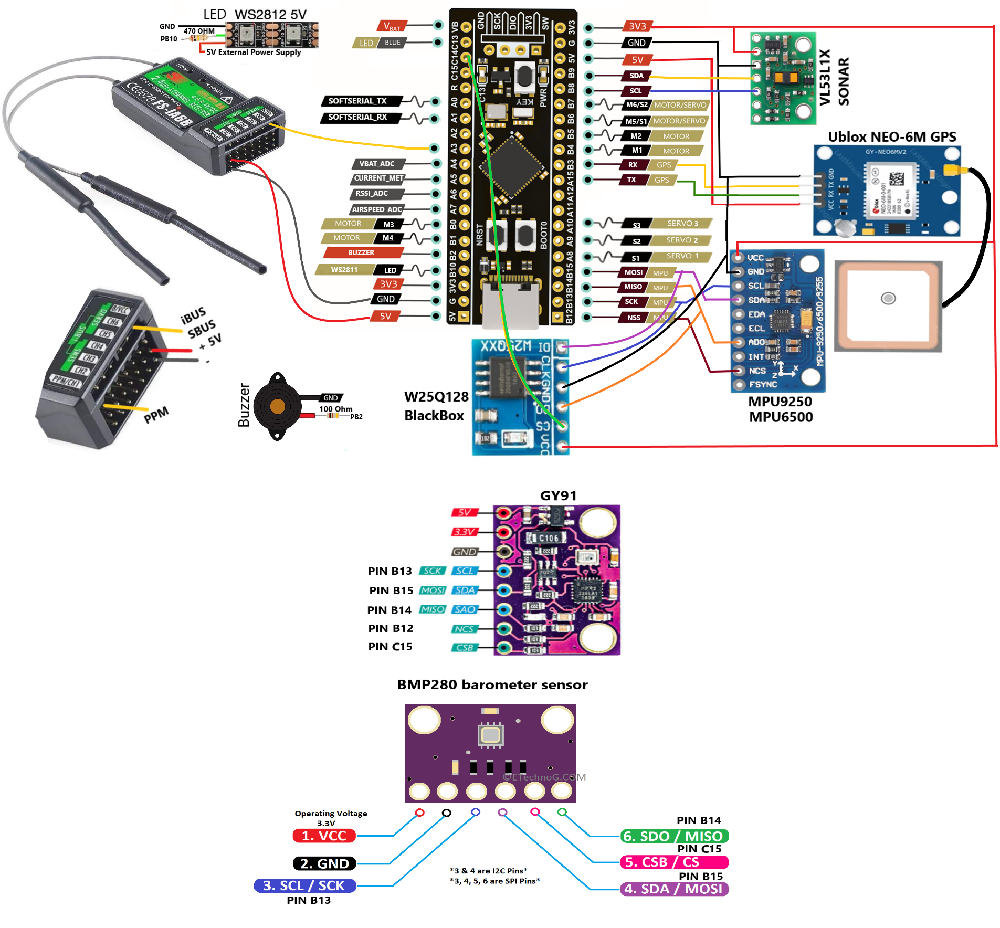
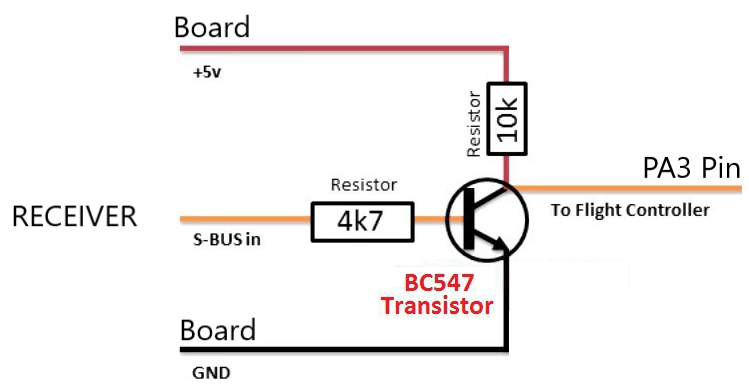

# STM32F411CE INAV Flight Controller

Compact and powerful **STM32F411CE based flight controller** designed for **INAV firmware**.

This controller supports multiple IMU sensors and provides essential interfaces for GPS, receivers, ESCs, telemetry and peripherals.

# ⚠️ Firmware Version Notice

## INAV 9.0.1 Update

This documentation is written for **INAV 9.0.1 firmware**.

The firmware for **INAV 9.0.1 has been redesigned and improved for better stability.**

⚠️ **Important**

Pin assignments used in **INAV 9.0.1** are **different from firmware versions earlier than INAV 9.0.1**.

Please make sure you follow the correct documentation for your firmware version.

| Firmware Version | Documentation |
|------------------|--------------|
| INAV 9.0.1 and newer | Use **this README** |
| Older than INAV 9.0.1 | Use **README2** |

Starting from **INAV 9.0.1**, the pin configuration provided in this document will remain the reference for future firmware releases.

---
# ⚡ Power Requirements

The flight controller **must be powered with a stable 5V DC supply**.

Most ESCs include a **5V BEC (Battery Eliminator Circuit)** that can be used to power the flight controller.

### Power Options

You can power the flight controller using one of the following methods:

1. **ESC with built-in 5V BEC**
2. **External 5V BEC module**

If your ESC **does not provide a 5V BEC**, you must use an **external regulated 5V BEC** to power the flight controller.

### ⚠️ Important Warning

- The flight controller **must not be powered directly from battery voltage**.
- Only use a **stable 5V DC supply**.

Supplying incorrect voltage may **permanently damage the flight controller**.

Always verify the output voltage of your BEC before connecting it to the FC.

---

# Detailed Diagram

---
## SBUS Signal Inverter
The inverter is easy to make, only requires 2 resistors (10K ohm and 4.7K ohm), 1 transistor (BC547b), and one cable. These are all very cheap and easy to find.

---

# ✈️ Features

- STM32F411CE MCU
- Supported IMU sensors  
  - MPU9250  
  - MPU6500  
  - BMI160
- BMP280 Barometer
- MAX7456 OSD
- 2 Hardware UART ports
- SoftSerial support
- I2C bus for compass and peripherals
- WS2811 LED strip support
- Up to **6 motor outputs**
- Additional **servo outputs**
- Battery voltage monitoring
- Current sensing
- RSSI analog input
- Airspeed sensor input

---

# 📦 Firmware

This flight controller runs **INAV Firmware**.

Download firmware:  inav_xxx_STM32F411CE.zip

`xxx` = firmware version number.

Example: inav_9.0.1_STM32F411CE.zip

---

# 🖥 INAV Configurator

Download the configurator matching the firmware version.

https://github.com/iNavFlight/inav-configurator/releases

Example:

| Firmware | Configurator |
|--------|--------|
| INAV 9.x | Configurator 9.x |

Extract the ZIP file and run: inav-configurator.exe

---

# 🔌 Enter DFU Mode

To flash firmware, the flight controller must be in **DFU mode**.

### Steps

1️⃣ Locate the **BOOT0 button** on the board

2️⃣ Press and **hold BOOT0**

3️⃣ Connect the USB cable to your PC

4️⃣ Release the button

If successful, **DFU** will appear in the configurator connection menu.

---

# ⚠ DFU Driver Fix

If DFU does not appear, install drivers using:

https://impulserc.blob.core.windows.net/utilities/ImpulseRC_Driver_Fixer.exe

Run the program and allow it to install the required drivers.

---

# 💾 Flashing Firmware

1. Open **INAV Configurator**

2. Go to  "Firmware Flasher"

3. Click "Load Firmware [Local]""

4. Select the file "inav_xxx_STM32F411CE.hex"

5. Click "Flash Firmware"

The firmware will start uploading.

---

# ✅ Successful Installation

If flashing is successful:

- wait a few seconds
- the **blue LED will start blinking**

🎉 Firmware installed successfully.

---

# 🧠 Supported IMU Sensors

This board supports the following SPI IMU sensors:

| Sensor |
|------|
MPU9250 |
MPU6500 |
BMI160 |

---

# 📍 Pinout

---

# 🧭 IMU (SPI)

| Signal | Pin |
|------|------|
SCK | PB13 |
MISO | PB14 |
MOSI | PB15 |
CS | PB12 |

---

# 🌡 Barometer (BMP280)

| Signal | Pin |
|------|------|
CS | PC15 |

---

# 📺 OSD (MAX7456)

| Signal | Pin |
|------|------|
CS | PC14 |

---
# ⭐ I2C Supported IMU Sensors
ALL Barometer, All Compass sensors.

# 🔗 I2C

| Signal | Pin |
|------|------|
SCL | PB8 |
SDA | PB9 |

---

# 🔔 Beeper

| Function | Pin |
|--------|--------|
Beeper | PB2 |

---

# 🔌 UART Ports

### UART1

| Function | Pin |
|------|------|
TX | PA15 |
RX | PB3 |

---

### UART2

| Function | Pin |
|------|------|
TX | PA2 |
RX | PA3 |

---

# 🔌 Wiring Guide

## UART1 GPS Connection

| GPS | Flight Controller |
|----|----|
TX | RX (UART) PB3 Pin|
RX | TX (UART) PA15 Pin|
5V | 5V |
GND | GND |

---

## UART2 Receiver Connection

### SBUS /iBUS

| Receiver | FC | FC Pin |
|----|----|----|
Signal | RX | PA3 Pin  |
5V | 5V | External 5V  |
GND | GND | Common GND |

### CRSF / ELRS

| Receiver | FC | FC Pin |
|----|----|----|
TX | RX | PA3 Pin  |
RX | TX | PA2 Pin  |
5V | 5V | External 5V  |
GND | GND | Common GND |

---

## ESC Connection

| ESC | FC |
|----|----|
Signal | Motor Pin PB4  |
Signal | Motor Pin PB5  |
Signal | Motor Pin PB0  |
Signal | Motor Pin PB1  |
5V | BEC |
GND | GND |

---

# 🧵 SoftSerial

| Function | Pin |
|------|------|
TX | PA0 |
RX | PA1 |

---

# ⚡ ADC Inputs

| Function | Pin |
|------|------|
VBAT | PA4 |
Current Meter | PA5 |
RSSI | PA6 |
Airspeed | PA7 |

---

# 💡 LED Strip

| Function | Pin |
|------|------|
WS2811 LED | PB10 |

---

# 🌀 Motor Outputs

| Motor | Pin |
|------|------|
Motor1 | PB4 |
Motor2 | PB5 |
Motor3 | PB0 |
Motor4 | PB1 |
Motor5 / Servo | PB6 |
Motor6 / Servo | PB7 |

---

# 🎮 Servo Outputs

| Servo | Pin |
|------|------|
Servo1 | PA8 |
Servo2 | PA9 |
Servo3 | PA10 |

---

# ⚙ Recommended Setup Steps

After flashing firmware:

1. Calibrate accelerometer
2. Calibrate compass
3. Configure receiver
4. Configure motor outputs
5. Setup GPS (if used)
6. Setup flight modes

---

# 🔗 Useful Links

INAV Official Website

https://inavflight.com

INAV GitHub

https://github.com/iNavFlight

INAV Documentation

https://github.com/iNavFlight/inav/wiki

---

# 📜 License

This project is open-source and intended to support the INAV ecosystem.

---

# ❤️ Acknowledgements

Special thanks to the **INAV community** and developers for their continuous work on the firmware.

